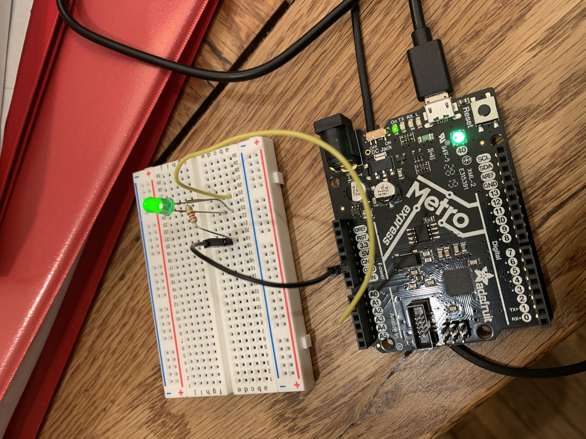

# CircuitPython

## Connecting to Github LED Blink
I am figuring out coding for the metroexpress, but making an LED Blink was relatively simple. The bigger challenge is just remembering the process of commiting and pushing the code into git, as I accidently made a duplicate CircuitPython clone in the process. The code for this assignment (and all future assignments) is not in the readme, but it's a file in the repository.

 

## CircuitPython Servo
In this assignment, I wired up a servo using capacitive touch, which involved a touchio function. While I was researching to create my "while True" loop, I learned about the statement "elif", which is similar to else in that it allows for multiple possible conditions whithin the "while True" section. This allowed me to write "if one thing" and then "elif another thing". I also had some issues with committing my code to GitHub because when I pulled my changes locally, they split. With help, I learned that I had to commit to merge the changes and then push them both to GitHub.

 
