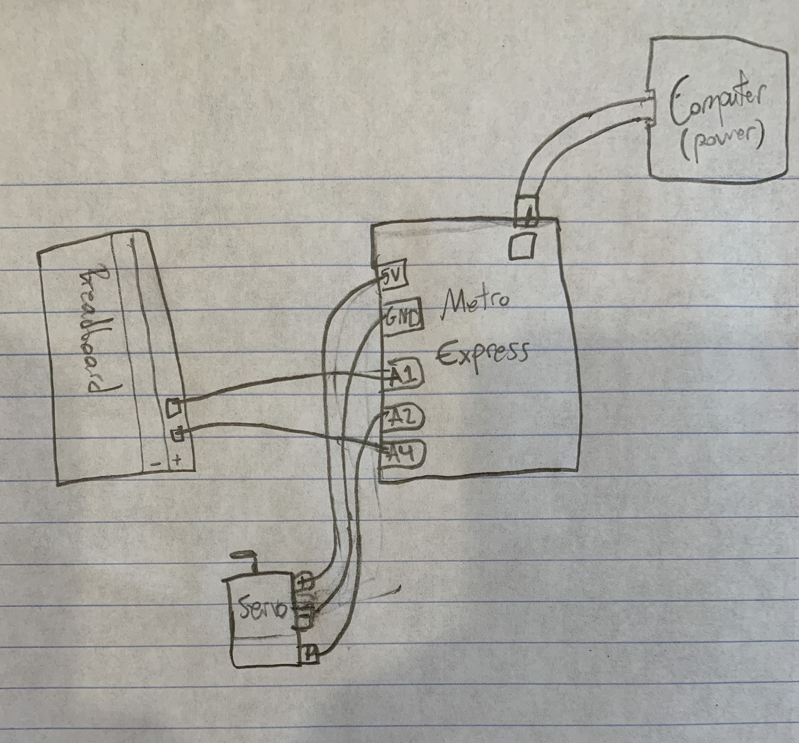

# CircuitPython

## Connecting to Github LED Blink
I am figuring out coding for the metroexpress, but making an LED Blink was relatively simple. The bigger challenge is just remembering the process of commiting and pushing the code into git, as I accidently made a duplicate CircuitPython clone in the process. The code for this assignment (and all future assignments) is not in the readme, but it's a file in the repository.

 

## CircuitPython Servo
In this assignment, I wired up a servo using capacitive touch, which involved a touchio function. While I was researching to create my "while True" loop, I learned about the statement "elif", which is similar to else in that it allows for multiple possible conditions whithin the "while True" section. This allowed me to write "if one thing" and then "elif another thing". I also had some issues with committing my code to GitHub because when I pulled my changes locally, they split. With help, I learned that I had to commit to merge the changes and then push them both to GitHub.

 

## CircuitPython LCD
In this assignment, I wired an LCD using capacitive touch: when one wire was touched, the counting direction was set to positive or negative, and when the other wire was touched, the count was increased or decreased (accroding to wire 1) by a magnitude of 1. While writing the code, I had a lot of trouble with the i2c file, as it did not process correctly within my code. I eventually wiped my Metro Express and started over, which helped, and then I had to remember to change the i2cInterface() to contain 0x3f rather than 0x27. I also had instances of my computer not registering my Metro Express when I plugged it in, which made it hard to restart, but switching the port that I plug it into has helped so far, so hopefully I don't run into this problem much more, as it is very hard to solve any other way. When I finally had my code working and my LCD running the code, I had trouble pushing my code to my GitHub repository, as I received the message that my repository could not be accessed after I committed the code and tried to push it. To fix this, I had to...
