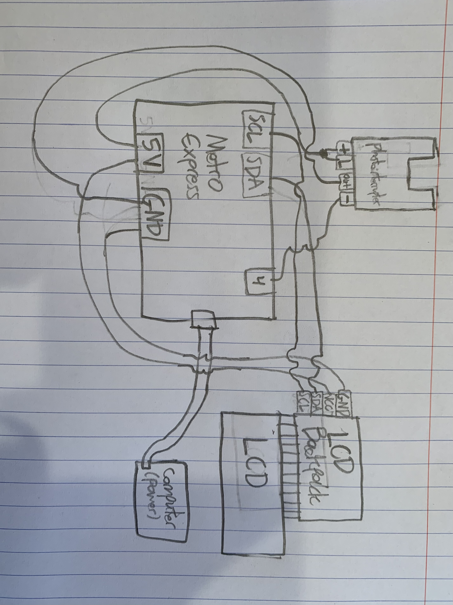
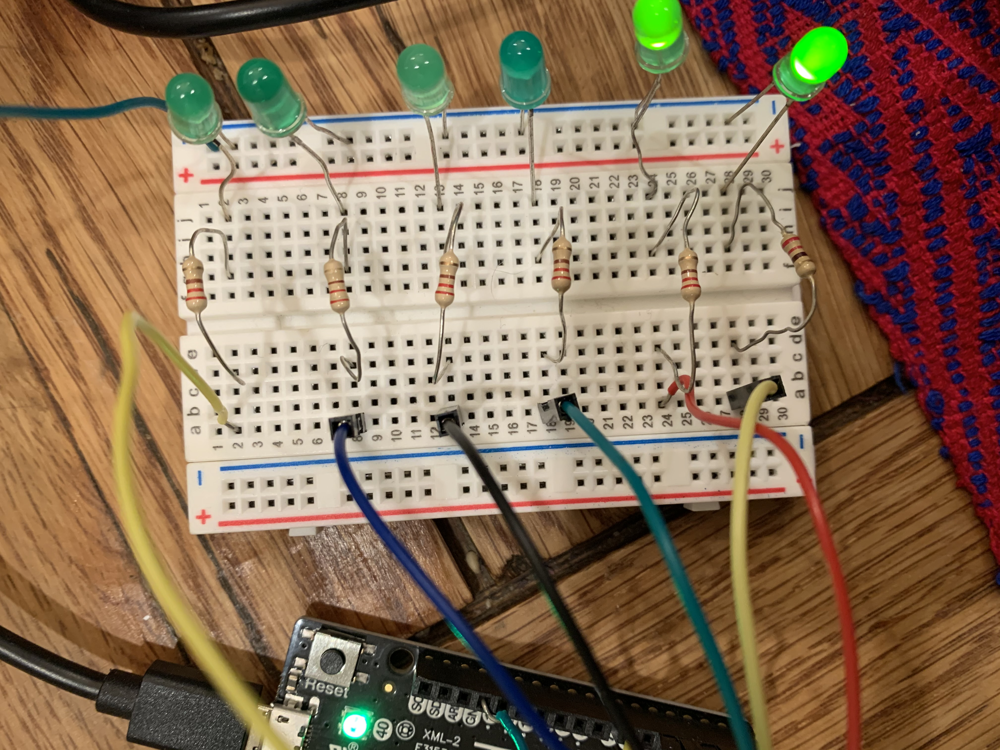

# CircuitPython

Codes created on Caret

Used Beagle Term for Serial Monitor

Connected to GitHub through Termux

## Connecting to Github LED Blink
I am figuring out coding for the metroexpress, but making an LED Blink was relatively simple. The bigger challenge is just remembering the process of commiting and pushing the code into git, as I accidently made a duplicate CircuitPython clone in the process. The code for this assignment (and all future assignments) is not in the README, it's a file in the repository.

 

## CircuitPython Servo
In this assignment, I wired up a servo using capacitive touch, which involved a touchio function. While I was researching to create my "while True" loop, I learned about the statement "elif", which is similar to else in that it allows for multiple possible conditions whithin the "while True" section. This allowed me to write "if one thing" and then "elif another thing". I also had some issues with committing my code to GitHub because when I pulled my changes locally, they split. With help, I learned that I had to commit to merge the changes and then push them both to GitHub.

 

## CircuitPython LCD
In this assignment, I wired an LCD using capacitive touch: when one wire was touched, the counting direction was set to positive or negative, and when the other wire was touched, the count was increased or decreased (accroding to wire 1) by a magnitude of 1. While writing the code, I had a lot of trouble with the i2c file, as it did not process correctly within my code. I eventually wiped my Metro Express and started over, which helped, and then I had to remember to change the i2cInterface() to contain 0x3f rather than 0x27. I also had instances of my computer not registering my Metro Express when I plugged it in, which made it hard to restart, but switching the port that I plug it into has helped so far, so hopefully I don't run into this problem much more, as it is very hard to solve any other way. When I finally had my code working and my LCD running the code, I had trouble pushing my code to my GitHub repository, as I received the message that the remote contains work that I do not have locally. To fix this issue, I had to pull my changes from my git repository, commit changes, and the push all of my committed changes up to my git repository (along with the code).

 

## CircuitPython Photointerrupter
In this assignment, I wired a photointerrupter and had it keep track of the number of times I interrupted it. My LCD screen displayed the number of interrupts along with my serial monitor, which outputted the number of interrupts every 4 seconds. There was a delay on the counter so that it could register individual interrupts. I learned more about the str(counter) function, which is a string required for displaying a variable along with words. My only struggles were running into the "remote contains work that I do not have locally" issue again (which I solved in the last assignment) and a deprecation notice when I typed in my GitHub info into Termux. I received a notice from GitHub that "basic authentication using a password to Git is deprecated and will soon no longer work." However, it worked after I had to pull my changes locally to solve the previous issue, so maybe it was just an error related to that issue. Either way, I'm interested to see what will come out of this issue, as I am always required to sign into my GitHub account when I push changes to GitHub from Termux.

 

## CircuitPython Distance Sensor
In this assignment, I wired an HC-SR04 distance sensor to set the color on the Metro Express's neopixel. The color changed between red, pink, blue, cyan, and green depending on an object's distance from the sensor. I learned that an (int) or integer function will always convert a number with decimals (5.8) to the first integer (5). I had to do some mth, as the difference between the max and min distance (35-5=30) had to be divided by four (30/4=7.5) because there were four changes between colors, and, to properly transition the colors, as the object's distance from the sensor increases, the neopixel first had to be made red with an increasing amount of blue, then blue with a decreasing amount of red, then blue with an increasing amount of green, then green with a decreasing amount of blue. For each range, the distance had to be subtracted by thw hightest possible distance from the previous range to ensure that the data range stayed between 0 and 255. I also learned that the dot.fill((red, green, blue)) statement is needed to create a loop, since the previous "if" statements only creates new conditions within the code and doesn't create a loop. Overall, the process went relatively well after I figured out the above pieces of information, except for the fact that I had some trouble with using pins 3 and 4 on my Metro Express for my distance sensor and had to change them to pins 5 and 6.

 

## Classes, Objects, and Modules
In this assignment, I learned how to create classes with objects, modules, and specific properties. I had to make a class of RGB LEDs (rgb.py) that supported a code that caused the LEDs to cycle through different colors (rgbshine.py), which required the self argument, which refers an object to itself when writing specific methods/modules. I had to learn to write self.r, self.g, and self.b and that False is on and True is off because the led pins are going to ground. The wiring was a little chaotic so I am including three pictures of the wiring instead of a written diagram.

 

 

 

## FancyLED
This assignment was a follow up to the previous; there was a set code (LEDdance.py) that was supposed to make LEDs "alternate, blink, chase, and sparkle" and I then created a FancyLED class (FancyLED.py) that allowed the set code to work. I learned about a bracketed list, which, in this case, puts the "self" statement for 3 LEDs into 1 statement. I also learned about the "%2" action, which divides a number by 2 and then looks at the remainder, which can be helpful to delegate different results for odd and even numbers. I also learned about the range function, which states the number of times the code should repeat (starting from 0 and going to one less than the max value). I then discovered the randrange method, which allowed me to generate random numbers - found in the "random" library. Overall, I improved my understanding of classes from the previous assignment, but I am still figuring them out. However, I eventually figured out this assignment (with some help) and was able to create a successful class.

 

 

 
